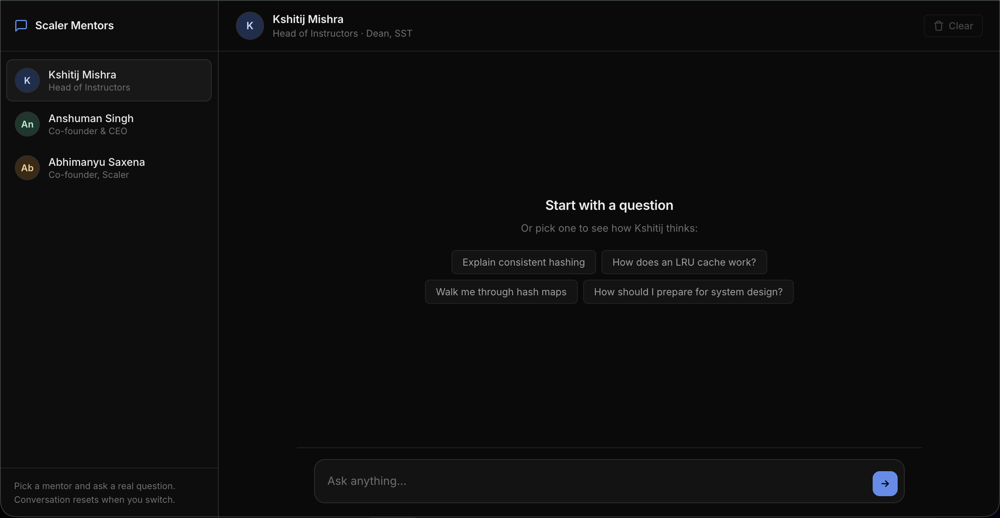
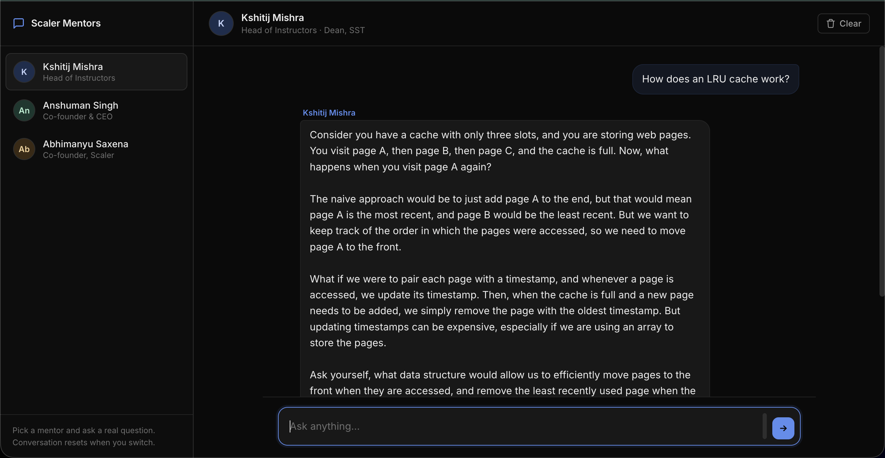

# Scaler Mentors — Persona-Based AI Chatbot

Have a real conversation with three Scaler personalities — **Kshitij Mishra**, **Anshuman Singh**, and **Abhimanyu Saxena**. Each persona has its own carefully researched system prompt, voice, and few-shot examples, so the bot genuinely sounds like the person you picked.

> **Live demo:** <https://harmonious-cajeta-76802c.netlify.app>

## Screenshots

**Home — sidebar with persona switcher and quick-start chips**


**Conversation — Kshitij explaining a concept Socratically**


## Stack

- **Backend:** [Bun](https://bun.sh) + [Vercel AI SDK](https://sdk.vercel.ai) + [Groq](https://groq.com) (`llama-3.3-70b-versatile`)
- **Frontend:** Plain HTML / CSS / JS — no build step
- **Deployed on:** Backend → Railway / Render · Frontend → Vercel / Netlify / GitHub Pages

## Features

- Three distinct personas with full system prompts, few-shot examples, and silent chain-of-thought
- Per-persona suggestion chips (quick-start questions)
- Animated typing indicator
- Multi-turn conversation memory (resets on persona switch)
- Per-persona color theming
- Mobile responsive
- Graceful error handling
- API key stored in environment variables — never committed

## Project Structure

```text
persona-based-chatbot/
├── backend/
│   ├── index.ts              # Bun server (routes /api/health, /api/persons, /api/chat)
│   ├── person1/              # Kshitij Mishra
│   │   ├── systemPrompt.ts
│   │   └── fewShotExamples.ts
│   ├── person2/              # Anshuman Singh
│   ├── person3/              # Abhimanyu Saxena
│   ├── .env.example
│   └── package.json
├── frontend/
│   ├── index.html
│   ├── style.css
│   └── script.js
├── prompts.md                # All three system prompts, annotated
└── reflection.md             # 300–500 word reflection
```

## Setup (local)

### 1. Get a Groq API key

Sign in at <https://console.groq.com/keys> and create a key. Free tier — no credit card needed.

### 2. Run the backend

```bash
cd backend
cp .env.example .env          # then paste your GROQ_API_KEY into .env
bun install
bun run start                 # listens on http://localhost:3000
```

Sanity check: open <http://localhost:3000/api/health> → should return `{"ok":true}`.

### 3. Run the frontend

In a second terminal:

```bash
cd frontend
python3 -m http.server 5173   # or any static server
```

Open <http://localhost:5173>. Pick a mentor and start chatting.

## Deployment

### Backend (Railway / Render / Fly)

1. Push the repo to GitHub
2. Create a new service from the `backend/` folder
3. Set environment variables:
   - `GROQ_API_KEY` — your Groq key
   - `ALLOWED_ORIGIN` — your deployed frontend URL (e.g. `https://scaler-mentors.vercel.app`)
4. Build command: `bun install`
5. Start command: `bun run start`

### Frontend (Vercel / Netlify / GitHub Pages)

1. Open [`frontend/script.js`](frontend/script.js) and update `API_URL_PROD` to your deployed backend URL
2. Deploy the `frontend/` directory
   - **Vercel:** `vercel deploy frontend/`
   - **Netlify:** drag the `frontend/` folder onto netlify.com
   - **GitHub Pages:** push `frontend/` to a branch and enable Pages

## API

| Method | Path           | Description                 |
| ------ | -------------- | --------------------------- |
| GET    | `/api/health`  | Health check                |
| GET    | `/api/persons` | List available personas     |
| POST   | `/api/chat`    | Send a message to a persona |

**Request body for `/api/chat`:**

```json
{
  "person": "kshitij",
  "message": "Explain consistent hashing",
  "history": [
    { "role": "user",      "content": "..." },
    { "role": "assistant", "content": "..." }
  ]
}
```

`history` is optional. The server keeps the last 12 turns.

## Documentation

- **[`prompts.md`](prompts.md)** — All three system prompts with inline commentary explaining the design choices
- **[`reflection.md`](reflection.md)** — Reflection on what worked, what GIGO taught me, and what I'd improve
